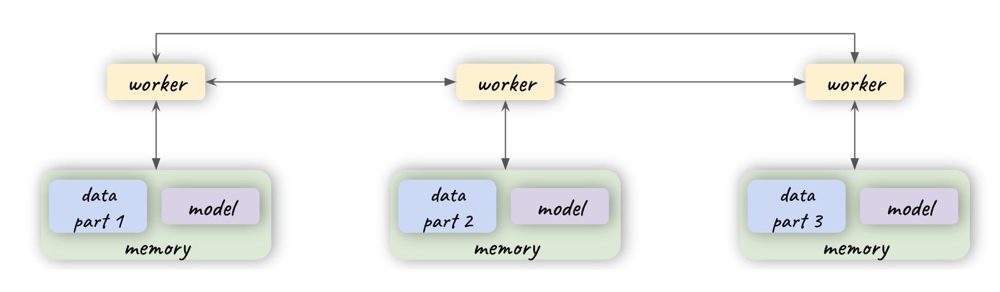

# Overview of Parallelism in Machine Learning

[Back to the homepage.](../index.html)

When computation moves into the distributed space, the opportunity to parallelize work across multiple machines and boost performance arises. Even better, parallelization, combined with intelligent partitioning, allows us to train large models that would otherwise be impossible to train on a single GPU. In this blog post, we investigate different types of parallelism and the situations in which each can be used.  

Let's first consider the case of using a single machine without any parallelism. There is only one worker, and the memory is large enough to store both the entire model and the dataset. Most models and training experiments fall under this category; they can train on a single GPU without issue. 

**Computational parallelism** occurs if all the workers have access to a shared memory which can store the entire model and dataset. In this case, we do not need to partition either the dataset or the model, and the workers have full access to everything in the shared memory. The infrastructure setup to enable computational parallelism is not very different compared to the case without any parallelism –– the difference is that instead of one worker, there will now be multiple accessing the same shared memory.

The problem arises when there is no sufficiently large shared memory between the workers, or when the shared memory access is limited by the memory bandwidth. Instead of a shared memory, the workers will have their local memory that is limited in size. In this case, we will have to partition the dataset and/or model and assign them to the local memory of different workers. 

**Data parallelism** can be used when the model is still small enough to fit in local memory but the dataset is large. The dataset is partitioned and then distribtued across the local memory of the workers. Dataset partitioning can be done by either partitioning by the individual entries or in the case of high dimensional data, partitioning by the dimensions. During training, each worker will update the gradients of the model with their slices of the dataset, and the model copies will then be aggreated either asynchronously or synchrously through communication between the workers. 

When the model becomes too large to fit in the local memory, **model parallelism** must be used. In this setup, each node stores a partial copy of the model. It's possible to have model parallelism and data parallelism at the same time, but for simplicity, we will assume here that all the workers will have access to all the data they need.

For neural networks, some possible ways of partioning are

1. Horizontally by layers
2. Vertically by connection locality
3. Randomly by pruning nodes and their associated connections. 

Partitioning a neural network horizontally is easy to implement, since it follows the natural logic of splitting the model by layers; however, the parallelism of this partitioning strategy is limited, and sometimes even the parameters of a single layer will not fit in the local memory. Vertical paritioning potentially allows more parallelism, but the dependency relations between data flows are more complex. The best way to partition a model for optimized performance must consider many factors such as data transfer between workers, ensuring a balance between memory-bound and compute-bound operations, and workload balancing. 

Furthermore, unlike in data parallelism where the model architecture does not need to be changed, significant engineering effort can be potentially spent on writing the models in a way to enable better model parallelism.

Combining partitioning with parallelism in a distributed compute setting allows us to greatly expand our set of feasible training recipes. Our goal is to provide an automated way to identify the best way to exploit these techniques for any training recipe that a user provides.

[Back to the homepage.](../index.html)
