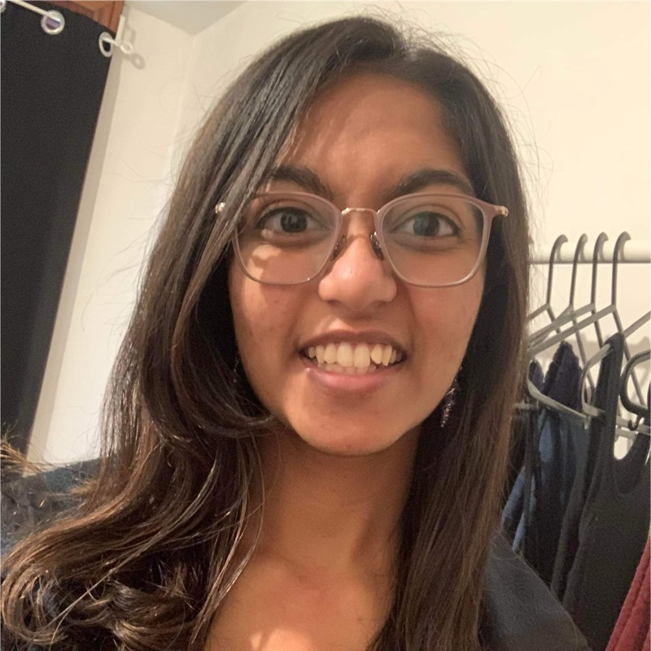

# TL;DR

## Please fill out [this form](https://forms.gle/8JkdKMSgt1UBr1n49)!

Hi! Thank you for stopping at our page. If you're an ML professional / researcher / enthusiast, we'd love your input at [this form](https://forms.gle/8JkdKMSgt1UBr1n49). Even if the entire form isn't relevant to your work, we'll take partially-filled out forms — every bit of information helps!

# INTRO

Deep learning models are growing in size, with today's state-of-the-art models relying on billions of parameters to make their predictions. For machine learning scientists, even training smaller versions of these models is increasingly difficult. The challenges that accompany training in a distributed setting (communicating between devices, setting up effective and accurate methods of parallelism, etc.) make it difficult for individuals or small teams to rapidly prototype with large models without large amounts of infrastructure supporting them. 

Check out this [blog post](./blog/intro-parallel-ml.html) for more information on current methods for distributed model training.

We're hoping to solve this problem, with a system that to the user makes distributed training as simple as training on a single machine. While our product is in-progress, we'd love to hear from the machine learning community about your experiences with distributed training. If you've gotten this far, we'd truly appreciate it if you could fill out [this form](https://forms.gle/8JkdKMSgt1UBr1n49). If you're interested in following our progress, there's an option on the form to put down your email. We'll send out updates as we have them :)

# ABOUT

This site was created by Nithya Attaluri and Anne Ouyang. We're MIT '23s very excited about machine learning and systems (computer architecture and performance engineering, respectively). Contact us at nithyaa@mit.edu and aouyang@mit.edu. 
